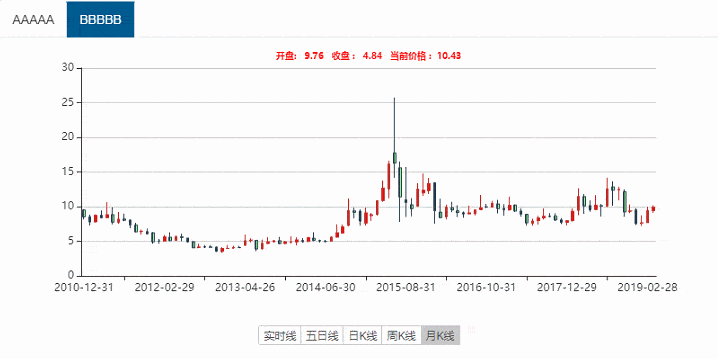

# echarts 实现股票分时图、五日图、日 K 线、周 K 线、月 K 线图

废话不多说，先上效果图：



直接上代码，使用 layui 模版渲染,使用前先引入 echarts

```html
<%@page contentType="text/html; charset=UTF-8"%> <%@ include file="init.jsp"%>
<script>
  Liferay.Loader.define._amd = Liferay.Loader.define.amd;
  Liferay.Loader.define.amd = false;
</script>
<script src="${ctx}/js/echarts.min.js"></script>
<script>
  Liferay.Loader.define.amd = Liferay.Loader.define._amd;
</script>
<style>
  .stock_charts_wraps .stock_card {
    margin: 0;
    border: none;
    box-shadow: none;
  }

  .stock_charts_wraps .stock_card .layui-tab-title {
    background: #fff;
  }

  .stock_charts_wraps .stock_card .layui-tab-title .layui-this {
    color: #fff;
    background: #076093;
  }

  div.control-bar-wrapper {
    opacity: 100 !important;
    visibility: visible !important;
  }

  a.apply-common-tooltip:nth-child(5) {
    display: none !important;
  }

  .chart-controls-bar a.apply-common-tooltip:nth-child(1) {
    display: none !important;
  }

  #stock_k_type {
    text-align: center;
  }

  #stock_k_type .layui-btn.active {
    background: #c9c9c9;
  }
</style>
<div class="lportal-wrapper bg-white" style="padding: 0;">
  <div
    class="stock_charts_wraps custom_module_common_wrap"
    style="height: 400px;"
  >
    <div class="layui-tab layui-tab-card stock_card">
      <ul class="layui-tab-title" id="stock_nav"></ul>
      <div
        class="layui-tab-content"
        id="stock_content"
        style="height: 320px; width: 100%;"
      ></div>
      <div id="stock_k_type">
        <div class="layui-btn-group">
          <button
            class="layui-btn layui-btn-primary layui-btn-xs"
            style="float: left; margin: 0 15px"
            onclick="stock.drawRealData(this);"
          >
            实时线
          </button>
          <button
            class="layui-btn layui-btn-primary layui-btn-xs"
            style="float: left; margin: 0 15px"
            onclick="stock.drawFiveData(this);"
          >
            五日线
          </button>
          <button
            class="layui-btn layui-btn-primary layui-btn-xs"
            style="float: left; margin: 0 15px"
            onclick="stock.drawDayData(this);"
          >
            日K线
          </button>
          <button
            class="layui-btn layui-btn-primary layui-btn-xs"
            style="float: left; margin: 0 15px"
            onclick="stock.drawWeekData(this);"
          >
            周K线
          </button>
          <button
            class="layui-btn layui-btn-primary layui-btn-xs"
            style="float: left; margin: 0 15px"
            onclick="stock.drawMonthData(this);"
          >
            月K线
          </button>
        </div>
      </div>
    </div>
  </div>
  <script id="demo" type="text/html">
      {{#  layui.each(d, function(index, item){ }}
      {{# if(index ===0){ }}
          <li class="layui-this" onclick="stock.loadData('{{item.stockCode}}','{{index}}','{{item.stockName}}')">{{item.stockName}}</li>
      {{# }else {  }}
          <li  onclick="stock.loadData('{{item.stockCode}}','{{index}}','{{item.stockName}}')">{{item.stockName}}</li>
      {{# } }}
    {{#  }); }}
  </script>
  <script id="cnt" type="text/html">
      {{#  layui.each(d, function(index, item){ }}
      {{# if(index ===0){ }}
          <div class="layui-tab-item layui-show">
            <div id="stockCharts_{{index}}"></div>
            <div id="stockCharts_no_data_{{index}}" style="display: none;"></div>
          </div>
      {{# }else {  }}
          <div class="layui-tab-item">
            <div id="stockCharts_{{index}}"></div>
            <div id="stockCharts_no_data_{{index}}" style="display: none;"></div>
          </li>
      {{# } }}
    {{#  }); }}
    {{#  if(d.length === 0){ }}
      无数据
    {{#  } }}
  </script>
  <script>
    var stock = {
      inteval: null,
      stockCode: "",
      stockIndex: 0,
      stockName: "",
      chartObj: {},
      chartsHeight: 300, //图表高度
      init: function() {
        //初始化
        // 请求list
        var laytpl = layui.laytpl;
        // 获取tab导航模板
        var getNavTpl = demo.innerHTML;
        // 获取tab内容模板
        var getContentTpl = cnt.innerHTML;
        // 获取股票容器
        var view = document.getElementById("stock_nav");
        // 获取图标容器
        var stockContent = document.getElementById("stock_content");
        // 请求股票列表
        $util.http.get("${getStockListURL}", {}, function(data) {
          if (data && data.length > 0) {
            // 渲染股票导航
            laytpl(getNavTpl).render(data, function(html) {
              view.innerHTML = html;
            });
            // 渲染股票内容容器
            laytpl(getContentTpl).render(data, function(html) {
              stockContent.innerHTML = html;
            });
            // 初始化股票数据
            stock.loadData(data[0].stockCode, 0, data[0].stockName);
          }
        });
      },
      loadData: function(code, index, stockName) {
        // 存储股票code
        this.stockCode = code;
        // 存储当前索引
        this.stockIndex = index;

        this.stockName = stockName;
        // 设置股票图表宽度
        $("#stockCharts_" + index).css({
          height: this.chartsHeight,
          width: $("#stock_k_type").width()
        });
        // 初始化股票对象
        this.chartObj = echarts.init(
          document.getElementById("stockCharts_" + this.stockIndex)
        );
        // 初始化日K线
        this.drawRealData($("#stock_k_type .layui-btn").eq(0));
      },
      drawRealData: function(obj) {
        // 获取实时数据
        var httpUrl =
          "${getStockDataURL}&<portlet:namespace/>code=" +
          this.stockCode +
          "&<portlet:namespace/>dataType=realtime";

        $(obj)
          .addClass("active")
          .siblings()
          .removeClass("active");
        $("#stockCharts_no_data_" + stock.stockIndex).hide();
        $("#stockCharts_" + stock.stockIndex).show();
        // 请求股票实时数据接口
        $util.http.get(httpUrl, {}, function(realtime) {
          if (realtime.status === 0) {
            var colsePrice = realtime.closingPirce
              ? realtime.closingPirce
              : "0.00";
            stock.chartObj.setOption({
              title: {
                text:
                  "开盘:   " +
                  realtime.openingPrice +
                  "   收盘 :   " +
                  colsePrice +
                  "   当前价格 :  " +
                  realtime.currentPrice,
                left: "center",
                textStyle: {
                  color: "#ff0000",
                  fontStyle: "normal",
                  fontWeight: "bold",
                  //字体系列
                  fontFamily: "sans-serif",
                  //字体大小
                  fontSize: 10
                }
              },
              tooltip: {
                trigger: "axis",
                formatter: function(params) {
                  params = params[0];
                  return "时间：" + params.name + "<br>当前价：" + params.value;
                },
                axisPointer: {
                  animation: false
                }
              },
              grid: {
                top: "8%",
                left: "10%",
                right: "10%",
                bottom: "15%"
              },
              dataZoom: [
                {
                  type: "slider",
                  show: false,
                  start: 0,
                  end: 100,
                  handleSize: 8
                },
                {
                  type: "inside",
                  start: 0,
                  end: 100
                }
              ],
              xAxis: {
                type: "category",
                splitLine: {
                  show: false
                },
                data: realtime.time,
                axisLabel: {
                  interval: 59,
                  formatter: function(value, index) {
                    if (value === "11:30") {
                      value = "11:30/13:00";
                    }
                    if (value === "13:59") {
                      value = "14:00";
                    }
                    if (value === "14:59") {
                      value = "15:00";
                    }
                    return value;
                  }
                }
              },
              yAxis: {
                type: "value",
                boundaryGap: [0, "100%"],
                splitLine: {
                  show: true
                },
                scale: true
              },
              series: [
                {
                  name: "模拟数据",
                  type: "line",
                  showSymbol: false,
                  hoverAnimation: false,
                  data: realtime.value
                }
              ]
            });
          } else {
            $("#stockCharts_" + stock.stockIndex).hide();
            $("#stockCharts_no_data_" + stock.stockIndex)
              .empty()
              .append(
                ''
              )
              .show();
          }
        });

        clearInterval(stock.inteval);
        var nowTime = new Date().getHours();
        // 当股票时间在 9点到 15点内  每隔1分钟调用一次接口
        if (9 <= nowTime && nowTime < 15) {
          stock.inteval = setInterval(function() {
            stock.drawRealData(obj);
          }, 1000 * 60);
        } else {
          clearInterval(stock.inteval);
        }
      },
      // 画日K线
      drawDayData: function(obj) {
        clearInterval(stock.inteval);
        var httpUrl =
          "${getStockDataURL}&<portlet:namespace/>code=" +
          this.stockCode +
          "&<portlet:namespace/>dataType=daily";
        $(obj)
          .addClass("active")
          .siblings()
          .removeClass("active");
        $("#stockCharts_no_data_" + stock.stockIndex).hide();
        $("#stockCharts_" + stock.stockIndex).show();
        $util.http.get(httpUrl, {}, function(daily) {
          if (daily.status === 0) {
            stock.chartObj.setOption({
              tooltip: {
                trigger: "axis",
                formatter: function(params) {
                  var res = params[0].seriesName + " " + params[0].name;
                  res +=
                    "<br/>  开盘 : " +
                    params[0].value[0] +
                    "  最高 : " +
                    params[0].value[3];
                  res +=
                    "<br/>  收盘 : " +
                    params[0].value[1] +
                    "  最低 : " +
                    params[0].value[2];
                  return res;
                }
              },
              grid: {
                top: "8%",
                left: "10%",
                right: "10%",
                bottom: "15%"
              },
              toolbox: {
                show: false,
                feature: {
                  mark: {
                    show: true
                  },
                  dataZoom: {
                    show: true
                  },
                  dataView: {
                    show: true,
                    readOnly: false
                  },
                  restore: {
                    show: true
                  },
                  saveAsImage: {
                    show: true
                  }
                }
              },
              dataZoom: [
                {
                  type: "slider",
                  show: false,
                  start: 0,
                  end: 100,
                  handleSize: 8
                },
                {
                  type: "inside",
                  start: 0,
                  end: 100
                }
              ],
              xAxis: [
                {
                  type: "category",
                  boundaryGap: true,
                  axisTick: {
                    onGap: false
                  },
                  splitLine: {
                    show: false
                  },
                  data: daily.date
                }
              ],
              yAxis: [
                {
                  type: "value",
                  scale: true,
                  boundaryGap: [0.01, 0.01]
                }
              ],
              series: [
                {
                  name: stock.stockName,
                  type: "k",
                  barMaxWidth: 20,
                  itemStyle: {
                    normal: {
                      color: "red", // 阳线填充颜色
                      color0: "lightgreen", // 阴线填充颜色
                      lineStyle: {
                        width: 2,
                        color: "orange", // 阳线边框颜色
                        color0: "green" // 阴线边框颜色
                      }
                    },
                    emphasis: {
                      color: "black", // 阳线填充颜色
                      color0: "white" // 阴线填充颜色
                    }
                  },
                  data: daily.value,
                  markPoint: {
                    symbol: "star",
                    //symbolSize:20,
                    itemStyle: {
                      normal: {
                        label: {
                          position: "top"
                        }
                      }
                    },
                    data: [
                      {
                        name: "最高",
                        value: 2444.8,
                        xAxis: "2013/2/18",
                        yAxis: 2466
                      }
                    ]
                  }
                }
              ]
            });
          } else {
            $("#stockCharts_" + stock.stockIndex).hide();
            $("#stockCharts_no_data_" + stock.stockIndex)
              .empty()
              .append(
                ''
              )
              .show();
          }
        });
      },
      //画五日K线
      drawFiveData: function(obj) {
        clearInterval(stock.inteval);
        var httpUrl =
          "${getStockDataURL}&<portlet:namespace/>code=" +
          this.stockCode +
          "&<portlet:namespace/>dataType=fivedays";
        $(obj)
          .addClass("active")
          .siblings()
          .removeClass("active");
        $("#stockCharts_no_data_" + stock.stockIndex).hide();
        $("#stockCharts_" + stock.stockIndex).show();
        $util.http.get(httpUrl, {}, function(fivedays) {
          if (fivedays.status === 0) {
            var data = [];
            $.each(fivedays.date, function(index, item) {
              data.push({
                name: item,
                value: [item, fivedays.data[index]]
              });
            });
            stock.chartObj.setOption({
              tooltip: {
                trigger: "axis",
                formatter: function(params) {
                  params = params[0];
                  var date = new Date(params.name);
                  return (
                    date.getFullYear() +
                    "/" +
                    (date.getMonth() + 1) +
                    "/" +
                    date.getDate() +
                    " : " +
                    params.value[1]
                  );
                },
                axisPointer: {
                  animation: false
                }
              },
              grid: {
                top: "8%",
                left: "10%",
                right: "10%",
                bottom: "15%"
              },
              xAxis: {
                type: "time",
                splitLine: {
                  show: false
                }
              },
              yAxis: {
                type: "value",
                boundaryGap: [0, "100%"],
                splitLine: {
                  show: true
                },
                scale: true
              },
              dataZoom: [
                {
                  type: "slider",
                  show: false,
                  start: 0,
                  end: 100,
                  handleSize: 8
                },
                {
                  type: "inside",
                  start: 0,
                  end: 100
                }
              ],
              series: [
                {
                  name: "模拟数据",
                  type: "line",
                  showSymbol: false,
                  hoverAnimation: false,
                  data: data
                }
              ]
            });
          } else {
            $("#stockCharts_" + stock.stockIndex).hide();
            $("#stockCharts_no_data_" + stock.stockIndex)
              .empty()
              .append(
                ''
              )
              .show();
          }
        });
      },
      // 画周K线
      drawWeekData: function(obj) {
        clearInterval(stock.inteval);
        $(obj)
          .addClass("active")
          .siblings()
          .removeClass("active");
        $("#stockCharts_no_data_" + stock.stockIndex).hide();
        $("#stockCharts_" + stock.stockIndex).show();
        var httpUrl =
          "${getStockDataURL}&<portlet:namespace/>code=" +
          this.stockCode +
          "&<portlet:namespace/>dataType=weekly";
        $util.http.get(httpUrl, {}, function(weekly) {
          if (weekly.status === 0) {
            stock.chartObj.setOption({
              tooltip: {
                trigger: "axis",
                formatter: function(params) {
                  var res = params[0].seriesName + " " + params[0].name;
                  res +=
                    "<br/>  开盘 : " +
                    params[0].value[0] +
                    "  最高 : " +
                    params[0].value[3];
                  res +=
                    "<br/>  收盘 : " +
                    params[0].value[1] +
                    "  最低 : " +
                    params[0].value[2];
                  return res;
                }
              },
              grid: {
                top: "8%",
                left: "10%",
                right: "10%",
                bottom: "15%"
              },
              toolbox: {
                show: false,
                feature: {
                  mark: {
                    show: true
                  },
                  dataZoom: {
                    show: true
                  },
                  dataView: {
                    show: true,
                    readOnly: false
                  },
                  restore: {
                    show: true
                  },
                  saveAsImage: {
                    show: true
                  }
                }
              },
              dataZoom: [
                {
                  type: "slider",
                  show: false,
                  start: 0,
                  end: 100,
                  handleSize: 8
                },
                {
                  type: "inside",
                  start: 0,
                  end: 100
                }
              ],
              xAxis: [
                {
                  type: "category",
                  boundaryGap: true,
                  axisTick: {
                    onGap: false
                  },
                  splitLine: {
                    show: false
                  },
                  data: weekly.date
                }
              ],
              yAxis: [
                {
                  type: "value",
                  scale: true,
                  boundaryGap: [0.01, 0.01]
                }
              ],
              series: [
                {
                  name: stock.stockName,
                  type: "k",
                  barMaxWidth: 20,
                  itemStyle: {
                    normal: {
                      color: "red", // 阳线填充颜色
                      color0: "lightgreen", // 阴线填充颜色
                      lineStyle: {
                        width: 2,
                        color: "orange", // 阳线边框颜色
                        color0: "green" // 阴线边框颜色
                      }
                    },
                    emphasis: {
                      color: "black", // 阳线填充颜色
                      color0: "white" // 阴线填充颜色
                    }
                  },
                  data: weekly.value,
                  markPoint: {
                    symbol: "star",
                    //symbolSize:20,
                    itemStyle: {
                      normal: {
                        label: {
                          position: "top"
                        }
                      }
                    },
                    data: [
                      {
                        name: "最高",
                        value: 2444.8,
                        xAxis: "2013/2/18",
                        yAxis: 2466
                      }
                    ]
                  }
                }
              ]
            });
          } else {
            $("#stockCharts_" + stock.stockIndex).hide();
            $("#stockCharts_no_data_" + stock.stockIndex)
              .empty()
              .append(
                ''
              )
              .show();
          }
        });
      },
      // 画月K线
      drawMonthData: function(obj) {
        clearInterval(stock.inteval);
        $(obj)
          .addClass("active")
          .siblings()
          .removeClass("active");
        $("#stockCharts_no_data_" + stock.stockIndex).hide();
        $("#stockCharts_" + stock.stockIndex).show();
        var httpUrl =
          "${getStockDataURL}&<portlet:namespace/>code=" +
          this.stockCode +
          "&<portlet:namespace/>dataType=monthly";
        $util.http.get(httpUrl, {}, function(monthly) {
          if (monthly.status === 0) {
            stock.chartObj.setOption({
              tooltip: {
                trigger: "axis",
                formatter: function(params) {
                  var res = params[0].seriesName + " " + params[0].name;
                  res +=
                    "<br/>  开盘 : " +
                    params[0].value[0] +
                    "  最高 : " +
                    params[0].value[3];
                  res +=
                    "<br/>  收盘 : " +
                    params[0].value[1] +
                    "  最低 : " +
                    params[0].value[2];
                  return res;
                }
              },
              grid: {
                top: "8%",
                left: "10%",
                right: "10%",
                bottom: "15%"
              },
              toolbox: {
                show: false,
                feature: {
                  mark: {
                    show: true
                  },
                  dataZoom: {
                    show: true
                  },
                  dataView: {
                    show: true,
                    readOnly: false
                  },
                  restore: {
                    show: true
                  },
                  saveAsImage: {
                    show: true
                  }
                }
              },
              dataZoom: [
                {
                  type: "slider",
                  show: false,
                  start: 0,
                  end: 100,
                  handleSize: 8
                },
                {
                  type: "inside",
                  start: 0,
                  end: 100
                }
              ],
              xAxis: [
                {
                  type: "category",
                  boundaryGap: true,
                  axisTick: {
                    onGap: false
                  },
                  splitLine: {
                    show: false
                  },
                  data: monthly.date
                }
              ],
              yAxis: [
                {
                  type: "value",
                  scale: true,
                  boundaryGap: [0.01, 0.01]
                }
              ],
              series: [
                {
                  name: stock.stockName,
                  type: "k",
                  barMaxWidth: 20,
                  itemStyle: {
                    normal: {
                      color: "red", // 阳线填充颜色
                      color0: "lightgreen", // 阴线填充颜色
                      lineStyle: {
                        width: 2,
                        color: "orange", // 阳线边框颜色
                        color0: "green" // 阴线边框颜色
                      }
                    },
                    emphasis: {
                      color: "black", // 阳线填充颜色
                      color0: "white" // 阴线填充颜色
                    }
                  },
                  data: monthly.value
                }
              ]
            });
          } else {
            $("#stockCharts_" + stock.stockIndex).hide();
            $("#stockCharts_no_data_" + stock.stockIndex)
              .empty()
              .append(
                ''
              )
              .show();
          }
        });
      }
    };
    layui.use(["element", "laytpl"], function() {
      var element = layui.element;
      stock.init();
    });
  </script>
</div>
```
