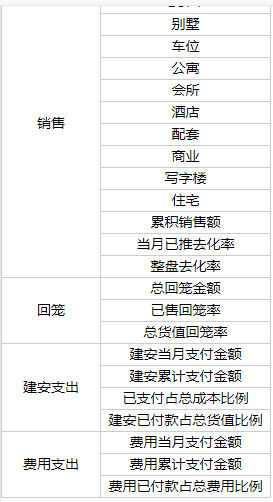

# vue 用 table 实现 相同的合并单元格

效果图如下：

;

html 模板

```html
<table>
  <tr v-for="(item,index) in leftFixedTableData" :key="index">
    <td :rowspan="item.parentCodecount" v-if="item.parentCodeshow">
      {{item.parentName}}
    </td>
    <td v-if="index !== 0">{{item.indexName}}</td>
  </tr>
</table>
```

原数据

```html
<script>
  [
    {
      indexCode: "lgbr_target_gh10",
      indexName: "楼栋",
      edit: false,
      parentCode: "lgbr_category_01",
      parentName: "供货"
    },
    {
      indexCode: "lgbr_target_gh11",
      indexName: "楼栋货值(亿元)",
      edit: false,
      parentCode: "lgbr_category_01",
      parentName: "供货"
    },
    {
      indexCode: "LOFT",
      indexName: "LOFT",
      edit: true,
      parentCode: "lgbr_category_01",
      parentName: "供货"
    },
    {
      indexCode: "别墅",
      indexName: "别墅",
      edit: true,
      parentCode: "lgbr_category_01",
      parentName: "供货"
    },
    {
      indexCode: "车位",
      indexName: "车位",
      edit: true,
      parentCode: "lgbr_category_01",
      parentName: "供货"
    },
    {
      indexCode: "公寓",
      indexName: "公寓",
      edit: true,
      parentCode: "lgbr_category_01",
      parentName: "供货"
    },
    {
      indexCode: "会所",
      indexName: "会所",
      edit: true,
      parentCode: "lgbr_category_01",
      parentName: "供货"
    },
    {
      indexCode: "酒店",
      indexName: "酒店",
      edit: true,
      parentCode: "lgbr_category_01",
      parentName: "供货"
    },
    {
      indexCode: "配套",
      indexName: "配套",
      edit: true,
      parentCode: "lgbr_category_01",
      parentName: "供货"
    },
    {
      indexCode: "商业",
      indexName: "商业",
      edit: true,
      parentCode: "lgbr_category_01",
      parentName: "供货"
    },
    {
      indexCode: "写字楼",
      indexName: "写字楼",
      edit: true,
      parentCode: "lgbr_category_01",
      parentName: "供货"
    },
    {
      indexCode: "住宅",
      indexName: "住宅",
      edit: true,
      parentCode: "lgbr_category_01",
      parentName: "供货"
    },
    {
      indexCode: "lgbr_target_gh02",
      indexName: "当月货值",
      edit: false,
      parentCode: "lgbr_category_01",
      parentName: "供货"
    },
    {
      indexCode: "lgbr_target_gh03",
      indexName: "已推总货值",
      edit: false,
      parentCode: "lgbr_category_01",
      parentName: "供货"
    },
    {
      indexCode: "lgbr_target_gh04",
      indexName: "当月可售货值",
      edit: false,
      parentCode: "lgbr_category_01",
      parentName: "供货"
    },
    {
      indexCode: "lgbr_target_gh05",
      indexName: "货值占全盘比例",
      edit: false,
      parentCode: "lgbr_category_01",
      parentName: "供货"
    },
    {
      indexCode: "lgbr_target_gh06",
      indexName: "已推占全盘比例",
      edit: false,
      parentCode: "lgbr_category_01",
      parentName: "供货"
    },
    {
      indexCode: "lgbr_target_xs02",
      indexName: "当月销售额",
      edit: false,
      parentCode: "lgbr_category_02",
      parentName: "销售"
    },
    {
      indexCode: "LOFT",
      indexName: "LOFT",
      edit: true,
      parentCode: "lgbr_category_02",
      parentName: "销售"
    },
    {
      indexCode: "别墅",
      indexName: "别墅",
      edit: true,
      parentCode: "lgbr_category_02",
      parentName: "销售"
    },
    {
      indexCode: "车位",
      indexName: "车位",
      edit: true,
      parentCode: "lgbr_category_02",
      parentName: "销售"
    },
    {
      indexCode: "公寓",
      indexName: "公寓",
      edit: true,
      parentCode: "lgbr_category_02",
      parentName: "销售"
    },
    {
      indexCode: "会所",
      indexName: "会所",
      edit: true,
      parentCode: "lgbr_category_02",
      parentName: "销售"
    },
    {
      indexCode: "酒店",
      indexName: "酒店",
      edit: true,
      parentCode: "lgbr_category_02",
      parentName: "销售"
    },
    {
      indexCode: "配套",
      indexName: "配套",
      edit: true,
      parentCode: "lgbr_category_02",
      parentName: "销售"
    },
    {
      indexCode: "商业",
      indexName: "商业",
      edit: true,
      parentCode: "lgbr_category_02",
      parentName: "销售"
    },
    {
      indexCode: "写字楼",
      indexName: "写字楼",
      edit: true,
      parentCode: "lgbr_category_02",
      parentName: "销售"
    },
    {
      indexCode: "住宅",
      indexName: "住宅",
      edit: true,
      parentCode: "lgbr_category_02",
      parentName: "销售"
    },
    {
      indexCode: "lgbr_target_xs03",
      indexName: "累积销售额",
      edit: false,
      parentCode: "lgbr_category_02",
      parentName: "销售"
    },
    {
      indexCode: "lgbr_target_xs04",
      indexName: "当月已推去化率",
      edit: false,
      parentCode: "lgbr_category_02",
      parentName: "销售"
    },
    {
      indexCode: "lgbr_target_xs05",
      indexName: "整盘去化率",
      edit: false,
      parentCode: "lgbr_category_02",
      parentName: "销售"
    },
    {
      indexCode: "lgbr_target_hl02",
      indexName: "总回笼金额",
      edit: false,
      parentCode: "lgbr_category_03",
      parentName: "回笼"
    },
    {
      indexCode: "lgbr_target_hl03",
      indexName: "已售回笼率",
      edit: false,
      parentCode: "lgbr_category_03",
      parentName: "回笼"
    },
    {
      indexCode: "lgbr_target_hl04",
      indexName: "总货值回笼率",
      edit: false,
      parentCode: "lgbr_category_03",
      parentName: "回笼"
    },
    {
      indexCode: "lgbr_target_ja02",
      indexName: "建安当月支付金额",
      edit: true,
      parentCode: "lgbr_category_04",
      parentName: "建安支出"
    },
    {
      indexCode: "lgbr_target_ja03",
      indexName: "建安累计支付金额",
      edit: false,
      parentCode: "lgbr_category_04",
      parentName: "建安支出"
    },
    {
      indexCode: "lgbr_target_ja01",
      indexName: "已支付占总成本比例",
      edit: false,
      parentCode: "lgbr_category_04",
      parentName: "建安支出"
    },
    {
      indexCode: "lgbr_target_ja04",
      indexName: "建安已付款占总货值比例",
      edit: false,
      parentCode: "lgbr_category_04",
      parentName: "建安支出"
    },
    {
      indexCode: "lgbr_target_fy01",
      indexName: "费用当月支付金额",
      edit: true,
      parentCode: "lgbr_category_05",
      parentName: "费用支出"
    },
    {
      indexCode: "lgbr_target_fy02",
      indexName: "费用累计支付金额",
      edit: false,
      parentCode: "lgbr_category_05",
      parentName: "费用支出"
    },
    {
      indexCode: "lgbr_target_fy03",
      indexName: "费用已付款占总费用比例",
      edit: false,
      parentCode: "lgbr_category_05",
      parentName: "费用支出"
    }
  ];
</script>
```

format 处理过的数据

```html
<script>
  [
    {
      indexCode: "lgbr_target_gh10",
      indexName: "楼栋",
      edit: false,
      parentCode: "lgbr_category_01",
      parentName: "供货",
      indexCodecount: 1,
      indexCodeshow: true,
      indexNamecount: 1,
      indexNameshow: true,
      editcount: 1,
      editshow: true,
      parentCodecount: 17,
      parentCodeshow: true,
      parentNamecount: 17,
      parentNameshow: true
    },
    {
      indexCode: "lgbr_target_gh11",
      indexName: "楼栋货值(亿元)",
      edit: false,
      parentCode: "lgbr_category_01",
      parentName: "供货",
      indexCodecount: 1,
      indexCodeshow: true,
      indexNamecount: 1,
      indexNameshow: true,
      editcount: 1,
      editshow: true,
      parentCodecount: 1,
      parentCodeshow: false,
      parentNamecount: 1,
      parentNameshow: false
    },
    {
      indexCode: "LOFT",
      indexName: "LOFT",
      edit: true,
      parentCode: "lgbr_category_01",
      parentName: "供货",
      indexCodecount: 1,
      indexCodeshow: true,
      indexNamecount: 1,
      indexNameshow: true,
      editcount: 10,
      editshow: true,
      parentCodecount: 1,
      parentCodeshow: false,
      parentNamecount: 1,
      parentNameshow: false
    },
    {
      indexCode: "别墅",
      indexName: "别墅",
      edit: true,
      parentCode: "lgbr_category_01",
      parentName: "供货",
      indexCodecount: 1,
      indexCodeshow: true,
      indexNamecount: 1,
      indexNameshow: true,
      editcount: 1,
      editshow: false,
      parentCodecount: 1,
      parentCodeshow: false,
      parentNamecount: 1,
      parentNameshow: false
    },
    {
      indexCode: "车位",
      indexName: "车位",
      edit: true,
      parentCode: "lgbr_category_01",
      parentName: "供货",
      indexCodecount: 1,
      indexCodeshow: true,
      indexNamecount: 1,
      indexNameshow: true,
      editcount: 1,
      editshow: false,
      parentCodecount: 1,
      parentCodeshow: false,
      parentNamecount: 1,
      parentNameshow: false
    },
    {
      indexCode: "公寓",
      indexName: "公寓",
      edit: true,
      parentCode: "lgbr_category_01",
      parentName: "供货",
      indexCodecount: 1,
      indexCodeshow: true,
      indexNamecount: 1,
      indexNameshow: true,
      editcount: 1,
      editshow: false,
      parentCodecount: 1,
      parentCodeshow: false,
      parentNamecount: 1,
      parentNameshow: false
    },
    {
      indexCode: "会所",
      indexName: "会所",
      edit: true,
      parentCode: "lgbr_category_01",
      parentName: "供货",
      indexCodecount: 1,
      indexCodeshow: true,
      indexNamecount: 1,
      indexNameshow: true,
      editcount: 1,
      editshow: false,
      parentCodecount: 1,
      parentCodeshow: false,
      parentNamecount: 1,
      parentNameshow: false
    },
    {
      indexCode: "酒店",
      indexName: "酒店",
      edit: true,
      parentCode: "lgbr_category_01",
      parentName: "供货",
      indexCodecount: 1,
      indexCodeshow: true,
      indexNamecount: 1,
      indexNameshow: true,
      editcount: 1,
      editshow: false,
      parentCodecount: 1,
      parentCodeshow: false,
      parentNamecount: 1,
      parentNameshow: false
    },
    {
      indexCode: "配套",
      indexName: "配套",
      edit: true,
      parentCode: "lgbr_category_01",
      parentName: "供货",
      indexCodecount: 1,
      indexCodeshow: true,
      indexNamecount: 1,
      indexNameshow: true,
      editcount: 1,
      editshow: false,
      parentCodecount: 1,
      parentCodeshow: false,
      parentNamecount: 1,
      parentNameshow: false
    },
    {
      indexCode: "商业",
      indexName: "商业",
      edit: true,
      parentCode: "lgbr_category_01",
      parentName: "供货",
      indexCodecount: 1,
      indexCodeshow: true,
      indexNamecount: 1,
      indexNameshow: true,
      editcount: 1,
      editshow: false,
      parentCodecount: 1,
      parentCodeshow: false,
      parentNamecount: 1,
      parentNameshow: false
    },
    {
      indexCode: "写字楼",
      indexName: "写字楼",
      edit: true,
      parentCode: "lgbr_category_01",
      parentName: "供货",
      indexCodecount: 1,
      indexCodeshow: true,
      indexNamecount: 1,
      indexNameshow: true,
      editcount: 1,
      editshow: false,
      parentCodecount: 1,
      parentCodeshow: false,
      parentNamecount: 1,
      parentNameshow: false
    },
    {
      indexCode: "住宅",
      indexName: "住宅",
      edit: true,
      parentCode: "lgbr_category_01",
      parentName: "供货",
      indexCodecount: 1,
      indexCodeshow: true,
      indexNamecount: 1,
      indexNameshow: true,
      editcount: 1,
      editshow: false,
      parentCodecount: 1,
      parentCodeshow: false,
      parentNamecount: 1,
      parentNameshow: false
    },
    {
      indexCode: "lgbr_target_gh02",
      indexName: "当月货值",
      edit: false,
      parentCode: "lgbr_category_01",
      parentName: "供货",
      indexCodecount: 1,
      indexCodeshow: true,
      indexNamecount: 1,
      indexNameshow: true,
      editcount: 1,
      editshow: true,
      parentCodecount: 1,
      parentCodeshow: false,
      parentNamecount: 1,
      parentNameshow: false
    },
    {
      indexCode: "lgbr_target_gh03",
      indexName: "已推总货值",
      edit: false,
      parentCode: "lgbr_category_01",
      parentName: "供货",
      indexCodecount: 1,
      indexCodeshow: true,
      indexNamecount: 1,
      indexNameshow: true,
      editcount: 1,
      editshow: true,
      parentCodecount: 1,
      parentCodeshow: false,
      parentNamecount: 1,
      parentNameshow: false
    },
    {
      indexCode: "lgbr_target_gh04",
      indexName: "当月可售货值",
      edit: false,
      parentCode: "lgbr_category_01",
      parentName: "供货",
      indexCodecount: 1,
      indexCodeshow: true,
      indexNamecount: 1,
      indexNameshow: true,
      editcount: 1,
      editshow: true,
      parentCodecount: 1,
      parentCodeshow: false,
      parentNamecount: 1,
      parentNameshow: false
    },
    {
      indexCode: "lgbr_target_gh05",
      indexName: "货值占全盘比例",
      edit: false,
      parentCode: "lgbr_category_01",
      parentName: "供货",
      indexCodecount: 1,
      indexCodeshow: true,
      indexNamecount: 1,
      indexNameshow: true,
      editcount: 1,
      editshow: true,
      parentCodecount: 1,
      parentCodeshow: false,
      parentNamecount: 1,
      parentNameshow: false
    },
    {
      indexCode: "lgbr_target_gh06",
      indexName: "已推占全盘比例",
      edit: false,
      parentCode: "lgbr_category_01",
      parentName: "供货",
      indexCodecount: 1,
      indexCodeshow: true,
      indexNamecount: 1,
      indexNameshow: true,
      editcount: 1,
      editshow: true,
      parentCodecount: 1,
      parentCodeshow: false,
      parentNamecount: 1,
      parentNameshow: false
    },
    {
      indexCode: "lgbr_target_xs02",
      indexName: "当月销售额",
      edit: false,
      parentCode: "lgbr_category_02",
      parentName: "销售",
      indexCodecount: 1,
      indexCodeshow: true,
      indexNamecount: 1,
      indexNameshow: true,
      editcount: 1,
      editshow: true,
      parentCodecount: 14,
      parentCodeshow: true,
      parentNamecount: 14,
      parentNameshow: true
    },
    {
      indexCode: "LOFT",
      indexName: "LOFT",
      edit: true,
      parentCode: "lgbr_category_02",
      parentName: "销售",
      indexCodecount: 1,
      indexCodeshow: true,
      indexNamecount: 1,
      indexNameshow: true,
      editcount: 10,
      editshow: true,
      parentCodecount: 1,
      parentCodeshow: false,
      parentNamecount: 1,
      parentNameshow: false
    },
    {
      indexCode: "别墅",
      indexName: "别墅",
      edit: true,
      parentCode: "lgbr_category_02",
      parentName: "销售",
      indexCodecount: 1,
      indexCodeshow: true,
      indexNamecount: 1,
      indexNameshow: true,
      editcount: 1,
      editshow: false,
      parentCodecount: 1,
      parentCodeshow: false,
      parentNamecount: 1,
      parentNameshow: false
    },
    {
      indexCode: "车位",
      indexName: "车位",
      edit: true,
      parentCode: "lgbr_category_02",
      parentName: "销售",
      indexCodecount: 1,
      indexCodeshow: true,
      indexNamecount: 1,
      indexNameshow: true,
      editcount: 1,
      editshow: false,
      parentCodecount: 1,
      parentCodeshow: false,
      parentNamecount: 1,
      parentNameshow: false
    },
    {
      indexCode: "公寓",
      indexName: "公寓",
      edit: true,
      parentCode: "lgbr_category_02",
      parentName: "销售",
      indexCodecount: 1,
      indexCodeshow: true,
      indexNamecount: 1,
      indexNameshow: true,
      editcount: 1,
      editshow: false,
      parentCodecount: 1,
      parentCodeshow: false,
      parentNamecount: 1,
      parentNameshow: false
    },
    {
      indexCode: "会所",
      indexName: "会所",
      edit: true,
      parentCode: "lgbr_category_02",
      parentName: "销售",
      indexCodecount: 1,
      indexCodeshow: true,
      indexNamecount: 1,
      indexNameshow: true,
      editcount: 1,
      editshow: false,
      parentCodecount: 1,
      parentCodeshow: false,
      parentNamecount: 1,
      parentNameshow: false
    },
    {
      indexCode: "酒店",
      indexName: "酒店",
      edit: true,
      parentCode: "lgbr_category_02",
      parentName: "销售",
      indexCodecount: 1,
      indexCodeshow: true,
      indexNamecount: 1,
      indexNameshow: true,
      editcount: 1,
      editshow: false,
      parentCodecount: 1,
      parentCodeshow: false,
      parentNamecount: 1,
      parentNameshow: false
    },
    {
      indexCode: "配套",
      indexName: "配套",
      edit: true,
      parentCode: "lgbr_category_02",
      parentName: "销售",
      indexCodecount: 1,
      indexCodeshow: true,
      indexNamecount: 1,
      indexNameshow: true,
      editcount: 1,
      editshow: false,
      parentCodecount: 1,
      parentCodeshow: false,
      parentNamecount: 1,
      parentNameshow: false
    },
    {
      indexCode: "商业",
      indexName: "商业",
      edit: true,
      parentCode: "lgbr_category_02",
      parentName: "销售",
      indexCodecount: 1,
      indexCodeshow: true,
      indexNamecount: 1,
      indexNameshow: true,
      editcount: 1,
      editshow: false,
      parentCodecount: 1,
      parentCodeshow: false,
      parentNamecount: 1,
      parentNameshow: false
    },
    {
      indexCode: "写字楼",
      indexName: "写字楼",
      edit: true,
      parentCode: "lgbr_category_02",
      parentName: "销售",
      indexCodecount: 1,
      indexCodeshow: true,
      indexNamecount: 1,
      indexNameshow: true,
      editcount: 1,
      editshow: false,
      parentCodecount: 1,
      parentCodeshow: false,
      parentNamecount: 1,
      parentNameshow: false
    },
    {
      indexCode: "住宅",
      indexName: "住宅",
      edit: true,
      parentCode: "lgbr_category_02",
      parentName: "销售",
      indexCodecount: 1,
      indexCodeshow: true,
      indexNamecount: 1,
      indexNameshow: true,
      editcount: 1,
      editshow: false,
      parentCodecount: 1,
      parentCodeshow: false,
      parentNamecount: 1,
      parentNameshow: false
    },
    {
      indexCode: "lgbr_target_xs03",
      indexName: "累积销售额",
      edit: false,
      parentCode: "lgbr_category_02",
      parentName: "销售",
      indexCodecount: 1,
      indexCodeshow: true,
      indexNamecount: 1,
      indexNameshow: true,
      editcount: 1,
      editshow: true,
      parentCodecount: 1,
      parentCodeshow: false,
      parentNamecount: 1,
      parentNameshow: false
    },
    {
      indexCode: "lgbr_target_xs04",
      indexName: "当月已推去化率",
      edit: false,
      parentCode: "lgbr_category_02",
      parentName: "销售",
      indexCodecount: 1,
      indexCodeshow: true,
      indexNamecount: 1,
      indexNameshow: true,
      editcount: 1,
      editshow: true,
      parentCodecount: 1,
      parentCodeshow: false,
      parentNamecount: 1,
      parentNameshow: false
    },
    {
      indexCode: "lgbr_target_xs05",
      indexName: "整盘去化率",
      edit: false,
      parentCode: "lgbr_category_02",
      parentName: "销售",
      indexCodecount: 1,
      indexCodeshow: true,
      indexNamecount: 1,
      indexNameshow: true,
      editcount: 1,
      editshow: true,
      parentCodecount: 1,
      parentCodeshow: false,
      parentNamecount: 1,
      parentNameshow: false
    },
    {
      indexCode: "lgbr_target_hl02",
      indexName: "总回笼金额",
      edit: false,
      parentCode: "lgbr_category_03",
      parentName: "回笼",
      indexCodecount: 1,
      indexCodeshow: true,
      indexNamecount: 1,
      indexNameshow: true,
      editcount: 1,
      editshow: true,
      parentCodecount: 3,
      parentCodeshow: true,
      parentNamecount: 3,
      parentNameshow: true
    },
    {
      indexCode: "lgbr_target_hl03",
      indexName: "已售回笼率",
      edit: false,
      parentCode: "lgbr_category_03",
      parentName: "回笼",
      indexCodecount: 1,
      indexCodeshow: true,
      indexNamecount: 1,
      indexNameshow: true,
      editcount: 1,
      editshow: true,
      parentCodecount: 1,
      parentCodeshow: false,
      parentNamecount: 1,
      parentNameshow: false
    },
    {
      indexCode: "lgbr_target_hl04",
      indexName: "总货值回笼率",
      edit: false,
      parentCode: "lgbr_category_03",
      parentName: "回笼",
      indexCodecount: 1,
      indexCodeshow: true,
      indexNamecount: 1,
      indexNameshow: true,
      editcount: 1,
      editshow: true,
      parentCodecount: 1,
      parentCodeshow: false,
      parentNamecount: 1,
      parentNameshow: false
    },
    {
      indexCode: "lgbr_target_ja02",
      indexName: "建安当月支付金额",
      edit: true,
      parentCode: "lgbr_category_04",
      parentName: "建安支出",
      indexCodecount: 1,
      indexCodeshow: true,
      indexNamecount: 1,
      indexNameshow: true,
      editcount: 1,
      editshow: true,
      parentCodecount: 4,
      parentCodeshow: true,
      parentNamecount: 4,
      parentNameshow: true
    },
    {
      indexCode: "lgbr_target_ja03",
      indexName: "建安累计支付金额",
      edit: false,
      parentCode: "lgbr_category_04",
      parentName: "建安支出",
      indexCodecount: 1,
      indexCodeshow: true,
      indexNamecount: 1,
      indexNameshow: true,
      editcount: 1,
      editshow: true,
      parentCodecount: 1,
      parentCodeshow: false,
      parentNamecount: 1,
      parentNameshow: false
    },
    {
      indexCode: "lgbr_target_ja01",
      indexName: "已支付占总成本比例",
      edit: false,
      parentCode: "lgbr_category_04",
      parentName: "建安支出",
      indexCodecount: 1,
      indexCodeshow: true,
      indexNamecount: 1,
      indexNameshow: true,
      editcount: 1,
      editshow: true,
      parentCodecount: 1,
      parentCodeshow: false,
      parentNamecount: 1,
      parentNameshow: false
    },
    {
      indexCode: "lgbr_target_ja04",
      indexName: "建安已付款占总货值比例",
      edit: false,
      parentCode: "lgbr_category_04",
      parentName: "建安支出",
      indexCodecount: 1,
      indexCodeshow: true,
      indexNamecount: 1,
      indexNameshow: true,
      editcount: 1,
      editshow: true,
      parentCodecount: 1,
      parentCodeshow: false,
      parentNamecount: 1,
      parentNameshow: false
    },
    {
      indexCode: "lgbr_target_fy01",
      indexName: "费用当月支付金额",
      edit: true,
      parentCode: "lgbr_category_05",
      parentName: "费用支出",
      indexCodecount: 1,
      indexCodeshow: true,
      indexNamecount: 1,
      indexNameshow: true,
      editcount: 1,
      editshow: true,
      parentCodecount: 3,
      parentCodeshow: true,
      parentNamecount: 3,
      parentNameshow: true
    },
    {
      indexCode: "lgbr_target_fy02",
      indexName: "费用累计支付金额",
      edit: false,
      parentCode: "lgbr_category_05",
      parentName: "费用支出",
      indexCodecount: 1,
      indexCodeshow: true,
      indexNamecount: 1,
      indexNameshow: true,
      editcount: 1,
      editshow: true,
      parentCodecount: 1,
      parentCodeshow: false,
      parentNamecount: 1,
      parentNameshow: false
    },
    {
      indexCode: "lgbr_target_fy03",
      indexName: "费用已付款占总费用比例",
      edit: false,
      parentCode: "lgbr_category_05",
      parentName: "费用支出",
      indexCodecount: 1,
      indexCodeshow: true,
      indexNamecount: 1,
      indexNameshow: true,
      editcount: 1,
      editshow: true,
      parentCodecount: 1,
      parentCodeshow: false,
      parentNamecount: 1,
      parentNameshow: false
    }
  ];
</script>
```

处理数据的方法

```html
<script>
  export default {
    data() {
      return {
        leftFixedTableData: []
      };
    },
    methods: {
      formatData(data) {
        for (let key in data[0]) {
          let k = 0;
          while (k < data.length) {
            data[k][key + "count"] = 1;
            data[k][key + "show"] = true;
            for (var i = k + 1; i <= data.length - 1; i++) {
              if (data[k][key] == data[i][key] && data[k][key] != "") {
                data[k][key + "count"]++;
                data[k][key + "show"] = true;
                data[i][key + "count"] = 1;
                data[i][key + "show"] = false;
              } else {
                break;
              }
            }
            k = i;
          }
        }
        return data;
      }
    }
  };
</script>
```
